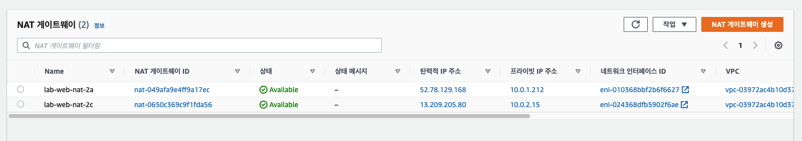

--------------------
# Aws-study
--------------------

# 목차

- [AWS FAQ](#AWS-FAQ)
- [서버리스 웹 호스팅과 CloudFront로 웹 가속화 구성하기](#서버리스-웹-호스팅과-CloudFront로-웹-가속화-구성하기)
    - [아키텍처에 구현할 기술](#아키텍처에-구현할-기술)

# AWS FAQ

- Amazon S3
  - FAQ : https://aws.amazon.com/ko/s3/faqs/?nc=sn&loc=7
- Amazon CloudFront
  - FAQ : https://aws.amazon.com/ko/cloudfront/faqs/?nc=sn&loc=5&dn=2
- Amazon EC2
  - FAQ : https://aws.amazon.com/ko/ec2/faqs/
- Elastic Load Balancer
  - FAQ : https://aws.amazon.com/ko/elasticloadbalancing/faqs/?nc=sn&loc=6
- Amazon VPC
  - FAQ : https://aws.amazon.com/ko/vpc/faqs/
- Amazon RDS
  - FAQ : https://aws.amazon.com/ko/rds/faqs/
- Auto Scaling
  - FAQ : https://aws.amazon.com/ko/autoscaling/faqs/
- IAM User
    - User 생성 가이드 : https://docs.aws.amazon.com/ko_kr/IAM/latest/UserGuide/id_users_create.html

# 서버리스 웹 호스팅과 CloudFront로 웹 가속화 구성하기

##  아키텍처에 구현할 기술

서버가 없이도 구성이 가능한 정적 웹 호스팅을 만들고, 웹 속도를 높이기 위하여 콘텐츠 전송 네트워크(CDN) 서비스를 연동합니다.

- 필요한 서비스
    - Amazon S3
    - Amazon CloudFront

## S3

Html, 영상, 기타 컨텐츠를 업로드하여 웹 호스팅 설정을 하게되면 웹 사이트처럼 작동할 수 있습니다.  
기본적으로 S3는 인터넷용 Storage 이며 웹 서비스 인터페이스를 사용해서 웹에서 언제든지 어디서나 원하는 양의  
데이터를 저장하고 검색할 수 있기 때문에 S3 만으로도 웹 호스팅이 가능하지만 웹 브라우저에서 읽어야 하는 컨텐츠  
크기가 커지면 그만큼 로딩이 지연되는 문제가 발생합니다.  
이러한 문제를 해결할 수 있는 것이 바로 `컨텐츠 전송 네트워크 서비스(CloudFront)` 입니다.

### S3 생성 후 살펴보기

1. 생성한 버킷
2. 메뉴 - 속성
    - 정적 웹 사이트 호스팅 - 편집 
    - 상태 - 활성화
    - 인덱스 문서 - 웹 사이트의 홈 페이지 또는 기본 페이지를 지정합니다.
        - index.html 작성하여 시작시 가장 처음 읽는 파일을 설정합니다.
3. 메뉴 - 권한
    - 버킷 정책 - 편집
    - 정책 생성기
        - Select Type of Policy : S3 Bucket Policy
    - 권한적인 부분(Add Statement) 설정
        - Principal : [ * ] 입력하여 모든 서비스를 적용한다고 명시합니다.
        - Actions : 어떠한 권한을 적용할것인지 설정합니다.
        - Amazon Resource Name (ARN) : 버킷 ARN 복사 붙여넣기하여 적용하기 (img_01)
        - Add Statement -> Generate Policy 클릭하여 생성된 정책을 복사합니다. (img_02)
    - 정책 편집기 - 정책 수정 (img_02)
        - 이렇게 되면 컨텐츠를 버킷에 올리더라도 웹 호스팅이 되지 않게 됩니다.
        - Resource : [ /* ] 문자를 추가하여 버킷 안에있는 모든 컨텐츠는 웹으로 나가는 것을 허용한다고 명시합니다. 
            - "Resource": "arn:aws:s3:::jjunpro-site/*",
    

- 4. html 업로드
    - html 파일 클릭 후 객체 URL 클릭 하면 서버없이 웹 호스팅이 가능합니다.

## CloudFront

컨텐츠를 빠르게 읽을 수 있도록 캐싱 기능을 제공하므로 더욱 가속화 된 웹을 제공할 수 있습니다.  

https://console.aws.amazon.com/cloudfront/home?region=ap-northeast-2#

1. Create Distribution -> Web Get Started
2. Distribution Settings - Price Class
    - 특정 지역에만 캐싱을 하겠다고 설정합니다.
        - Use Only U.S., Canada and Europe - 특정 지역
        - Use U.S., Canada, Europe, Asia, Middle East and Africa - 특정 지역
        - Use All Edge Locations (Best Performance) - 모든 지역
3. CloudFront에서 Create Distribution 클릭 후 Deploy가 되기까지는 약 5분~10분정도의 긴 시간이 소요
4. CloudFront 링크테스트
    - html 에서 불러오는 이미지의 경로를 CloudFront 도메인 으로 변경합니다.
    - 그리고 S3 버킷에 업로드 합니다.

~~~
<html>
<head>My CloudFront Test</head>
<body>

My text content goes here.

/awslogo.png" alt="AWS LOGO"/>

</body>
</html>
~~~ 

5. 브라우저 테스트
    - https://d1ut0p6g43vawo.cloudfront.net/index3.html
    - x-cache: Hit from cloudfront 
        정상적으로 cloudfront 로 캐싱된 상태임을 확인할 수 있습니다. 
    
 

# EC2-LAMP-ELB 구성하기

##  아키텍처에 구현할 기술

Linux 기반의 가상 서버에 Apache 웹 서버, MySQL 데이터베이스, php 어플리케이션을 구축하고 로드 밸런서를 이용하여 이중화 구성을 만듭니다.

- 필요 AWS 서비스
    - Amazon Elastic Compute Cloud(EC2)
    - Amazon Virtual Private cloud(VPC)
    - Elastic Load Balancing / Applicaion Load Balancer
    
서버를 생성하여 `Internet Gateway` 통하여 외부와 통신하게 됩니다.  
이런 단일 구성만으로도 시스템이 돌아가는데 문제는 없지만 실제로 운영되는 웹 서비스들은  
트래픽 증가 장애등과 같은 이슈가 발생할 가능성이 높은데  
이런 문제를 해결하기 위해서 여러개의 서버를 만들고  
네트워크 트래픽 분산 서비스의 `Elastic Load Balancing` 에 연결하여  
상황에 따라 시스템이 원활하게 돌아가도록 해줍니다.  
여기서 ELB 유형중에 `Applicaion Load Balancer` 을 사용합니다.

- 간단한 로직 표현
    - internet
        - Internet Gateway
            - ELB-ALB
                - EC2 서버
                - EC2 서버

## 1. amazon linux 2에 LAMP 웹 서버 설치하기
    - LAMP 서버 설치 및 테스트
        - EC2 생성 시 User Data 스크립트 추가하여 자동으로 설치
        - LAMP 서버 테스트
    - Custom AMI 생성
    - Custom AMI 로 두 번째 LAMP 서버 생성
    - PuTTY로 SSH 접속하여 데이터베이스 보안 설정

- EC2 생성 및 LAMP 웹 서버 설치
    - LAMP 웹 서버 설치를 위한 User Data 스크립트는 EC2가 생성되는 과정에서 Apache 웹 서버, MySQL 데이터베이스, PHP 어플리케이션이 설치될 수 있게 해줍니다.
    - 스크립트의 세부 내용은 아래와 같으며, EC2 생성 단계 중 User Data에 아래 내용을 복사하여 붙여넣으셔도 동일한 LAMP 웹 서버가 설치됩니다.

- [PuTTY를 이용하여 EC2에 접속]
    - Windows 환경에서 실습을 진행하시는 분들은 EC2에 SSH 접속을 하기 위해서 PuTTY라는 프로그램이 필요합니다. 이와 관련하여 아래 내용을 참고하여 주시기 바랍니다.
    - PuTTY 다운로드 페이지 : https://www.chiark.greenend.org.uk/~sgtatham/putty/latest.html
    - Mac 환경에서 실습을 진행하시는 분들은 기본 터미널 프로그램 또는 iTerm과 같은 프로그램을 사용하시면 됩니다.
- [Custom AMI(Amazon Machine Image) 생성 및 Custom AMI를 통한 EC2 생성]
    - AMI 생성에서 Create Image 클릭 후 Image 생성까지는 약 2분~3분정도의 시간이 소요되며, 원활한 실습 영상을 위하여 대기시간은 편집하였습니다.

## 2. Application Load Balancer 시작하기

1. Load Balancer 유형 선택
2. Load Balancer 및 리스너 구성
3. Load Balancer 에 대한 보안 그룹 구성
4. 대상 그룹 구성
5. 대상 그룹에 대상 등록
6. Load Balancer 생성 및 테스트
7. Load Balancer 삭제 선택 사항

## 3. 설치 진행하기

- https://ap-northeast-2.console.aws.amazon.com/ec2/v2/home?region=ap-northeast-2  
- EC2 인스턴스 시작 버튼을 클릭합니다.  
    - 1. AMI 선택Amazon Linux 2 AMI (HVM), SSD Volume Type
    - 2. 인스턴스 유형 선택 : t2.micro
    - 3. 인스턴스 세부 정보 구성
        - 서브넷 : ap-northeast-2a 선택
        - 퍼블릭 IP 자동 할당 : 자동을 공인 IP 를 받도록 설정 선택
        - 고급 세부 정보 
            - 사용자 데이터 : 시작 시 인스턴스를 구성하거나 구성 스크립트를 실행할 때 사용할 사용자 데이터를 지정할 수 있습니다.
                - #include https://bit.ly/Userdata
                - 혹은 아래 코드를 입력
    - 5. 태그 추가 : 어떤 용도의 EC2 인지 구분짓는 꼬리표입니다.
        - Key : Name
        - Value : lab-web-public-2a
            - 웹으로 사용하는 공개한 서브넷 서버의 2a
    - 6. 보안 그룹 구성 : aws 에서 기본으로 제공해주는 방화벽
        - 보안 그룹 이름 : lab-web-security
        - 기본적으로 Linux 이므로 SSH 규칙이 기본으로 설정되어 있습니다.
        - 추가로 웹 서버 테스트를 할것이므로 규칙을 추가합니다.
            - HTTP 규칙 추가 
                - 소스 : [ 0.0.0.0/0, ::/0 ] 에서 [ ::/0 ] IPV6 용 이므로 삭제합니다.
    - 7. EC2 웹으로 접근
        - 생성된 ec2 의 public 주소를 접근하면 정상적으로 aws 가동중인 웹페이지가 출력됩니다.
~~~
#!/bin/bash
yum update -y
amazon-linux-extras install -y lamp-mariadb10.2-php7.2 php7.2
yum install -y httpd mariadb-server
systemctl start httpd
systemctl enable httpd
usermod -a -G apache ec2-user
chown -R ec2-user:apache /var/www
chmod 2775 /var/www
find /var/www -type d -exec chmod 2775 {} \;
find /var/www -type f -exec chmod 0664 {} \;
echo "<?php phpinfo(); ?>" > /var/www/html/phpinfo.php
if [ ! -f /var/www/html/bootcamp-app.tar.gz ]; then
cd /var/www/html
wget https://s3.amazonaws.com/immersionday-labs/bootcamp-app.tar
tar xvf bootcamp-app.tar
chown apache:root /var/www/html/rds.conf.php
wget https://www.phpmyadmin.net/downloads/phpMyAdmin-latest-all-languages.tar.gz
mkdir phpMyAdmin && tar -xvzf phpMyAdmin-latest-all-languages.tar.gz -C phpMyAdmin --strip-components 1
cd /var/www/html/phpMyAdmin/
cp config.sample.inc.php config.inc.php
fi
~~~

## 4. Custom AMI(Amazon Machine Image) 생성 및 Custom AMI를 통한 EC2 생성

- 이미지 생성
    - 이름 : 어떤 용도의 AMI 를 생성하는지 구분 짓기 위해서 작성
        - lab-web-202104
    - 재부팅 안 함 : 해당 EC2 가 정지된 상태에서 이미지 생성을 하겠는가 아니면 러닝되어 있는 상태에서 생성을 하겠는가의 선택
        - 실제 서비스 중인 EC2 에서 재부팅 안함을 선택하고 생성하면 문제가 발생할 수 있음으로 체크해줍니다.
    - 이미지 생성
- EC2 에 2a 로 하나의 공간이 있습니다. 추가로 2c 를 방금 생성한 AMI 로 추가 생성하겠습니다.
- 추가로 생성된 이미지 확인
    - https://ap-northeast-2.console.aws.amazon.com/ec2/v2/home?region=ap-northeast-2#Images:
    - 생성된 이미지 체크 후 시작하기 버튼 클릭
        - 1, 2 동일하게 사용
        - 3. 인스턴스 세부 정보 구성
            - 서브넷 : ap-northeast-2a 선택
            - 고급 세부 정보 
                - 사용자 데이터 : 따로 작성할 필요 없습니다. 이미 복사된 AMI 에 추가되어 있기 때문입니다.
        - 5. 태그 추가 : 어떤 용도의 EC2 인지 구분짓는 꼬리표입니다.
                - Key : Name
                - Value : lab-web-public-2c
                    - 웹으로 사용하는 공개한 서브넷 서버의 2c
        - 6. 보안 그룹 구성 : 기존에 생성한 web 용 보안 그룹을 사용합니다.
            - 보안 그룹 이름 : lab-web-security

## 5. Load Balancer 설정

- https://ap-northeast-2.console.aws.amazon.com/ec2/v2/home?region=ap-northeast-2#LoadBalancers:
- Load Balancer 생성
    - Application Load Balancer
        - 1. Load Balancer 구성
            - 이름 : lab-web-alb
            - 체계 : 웹용의 인터널인지 내부용 인터널인지 설정
            - 리스너 : ELB 가 통과하는 트래픽의 포트번호를 정의
            - 가용 영역 : 2a, 2c
            - 태그
                - Key : Name
                - Value : lab-web-alb
        - 3. 보안 그룹 구성 : ALB 용 보안그룹을 따로 생성합니다.
        - 4. 라우팅 구성 : 어떤 EC2 를 등록하는지 설정합니다.
            - 이름 : lab-web-alb-target
        - 5. 대상 등록 : EC2 를 타겟 그룹으로 넣습니다.
            - 방금전에 생성한 EC2 [ 2a, 2c ] 를 선택합니다.
    - 생성된 ALB 의 DNS 이름
        - EC2 로 바로 접근해서 웹 페이지를 보느것이 아니라 ALB 의 DNS 를 활용해서 생성한 2개의 EC2 웹 화면을 보도록 분산시키겠습니다.
        - 생성된 ALB 도메인 네임을 검색
            - http://lab-web-alb-1384992291.ap-northeast-2.elb.amazonaws.com/
                - 새로고침 할때마다 [ 2a, 2c ] 번갈아 가며 서버가 교체됩니다. 정상적으로 분산되어 있는것을 확인했습니다.

# VPC 와 중계 서버(Bastion) 구성하기

가상의 네트워크에서 인터넷과 연결 또는 연결되지 않는 하위 네트워크를 만들고 다른 가상 서버와 연결하기 위한 중계 서버를 구성합니다.

필요한 AWS 서비스

- Amazon EC2
- Amazon Virtual Private Cloud(VPC)
- CIDR
- Subnetting

- Aws VPC 콘솔로 이동합니다.
    - https://ap-northeast-2.console.aws.amazon.com/vpc/home?region=ap-northeast-2#
- [가상 프라이빗 클라우드] 메뉴 탭에서 순서대로 진행합니다.
    - [VPC] 탭으로 들어가면 처음에 존재하는 VPC 가 기본으로 존재합니다.
        - [VPC 생성] 버튼 클릭
            - [이름 태그] : lab-vpc 으로 작성
            - [IPv4 CIDR 블록] : 서브넷 이상으로 가장 큰 ip 범위를 선언하는 칸 10.0.0.0/16 으로 작성
    - [서브넷]
        - [서브넷 생성] 1번째 서브넷 생성
            - [이름 태그] : lab-web-public1-2a 으로 작성
            - [VPC] : lab-vpc 선택
            - [가용 영역] : 아시아 태평양 (서울) / ap-northeast-2a
            - [IPv4 CIDR 블록] : 10.0.1.0/24 으로 작성하면 총 251개의 ip 를 사용할 수 있는 범위가 나옵니다.
        - [서브넷 생성] 2번째 서브넷 생성
            - [이름 태그] : lab-web-public2-2c 으로 작성
            - [VPC] : lab-vpc 선택
            - [가용 영역] : 아시아 태평양 (서울) / ap-northeast-2c
            - [IPv4 CIDR 블록] : 10.0.2.0/24
        - [서브넷 생성] 1번째 private 넷 생성
            - [이름 태그] : lab-web-private1-2a 으로 작성
            - [VPC] : lab-vpc 선택
            - [가용 영역] : 아시아 태평양 (서울) / ap-northeast-2a
            - [IPv4 CIDR 블록] : 10.0.3.0/24
        - [서브넷 생성] 2번째 private 넷 생성
            - [이름 태그] : lab-web-private2-2c 으로 작성
            - [VPC] : lab-vpc 선택
            - [가용 영역] : 아시아 태평양 (서울) / ap-northeast-2c
            - [IPv4 CIDR 블록] : 10.0.4.0/24
        - [서브넷 생성] 3번째 private 넷 생성
            - [이름 태그] : lab-web-private3-2a 으로 작성
            - [VPC] : lab-vpc 선택
            - [가용 영역] : 아시아 태평양 (서울) / ap-northeast-2a
            - [IPv4 CIDR 블록] : 10.0.5.0/24
        - [서브넷 생성] 4번째 private 넷 생성
            - [이름 태그] : lab-web-private4-2c 으로 작성
            - [VPC] : lab-vpc 선택
            - [가용 영역] : 아시아 태평양 (서울) / ap-northeast-2a
            - [IPv4 CIDR 블록] : 10.0.6.0/24
        - 이렇게 pulbic 2개와 private 4개 총 6개의 서브넷이 생성되었습니다.
    - [인터넷 게이트웨이] 생성된 총 6개의 서브넷을 각각 public || private 로 구성하는 라우팅 작업을 진행합니다.
        - [인터넷 게이트웨이 생성]
            - [이름 태그] : lab-web-igw
        - 생성된 인터넷 게이트웨이가 어느 VPC 의 트래픽을 연결해주는지 설정해줘야 합니다.
        - lab-web-igw 게이트웨이 선택 후 [작업] 버튼 클릭 [VPC에 연결] 버튼 선택
            - [사용 가능한 VPC] 방금 생성한 lab-vpc 선택
        - lab-web-igw 게이트 웨이는 lab-vpc 를 통해서 통신을 하도록 하겠다고 설정을 하였습니다.
    - [라우팅 테이블] 기본적으로 VPC 를 생성하면 따라서 생성되는 번들용 라우팅 테이블이 하나 존재합니다. 이를 이용해서 public 용으로 하나 생성할 것입니다. private 라우팅은 새로 만들도록 하겠습니다.
        - [lab-vpc] 라우팅 테이블
            - [이름 태그] : lab-web-rt-public
            - [라우팅] 인터넷으로 트래픽이 나가도록 라우트를 넣어줍니다.
                - [라우팅 편집] 라우팅 추가
                    - [대상] : 0.0.0.0/0 모든 ip 주소는 타겟으로 가라고 명시
                    - [대상] : lab-web-igw 방긍 생성한 인터넷 게이트를 선택합니다.
            - [서브넷 연결] 라우팅 테이블을 타고나가는 서브넷을 선택합니다.
                - [서브넷 연결 편집] public 용 서브넷 2개를 선택합니다.
    - [private 라우팅 테이블 2a]
        - [이름 태그] : lab-web-rt-private-2a
        - [VPC] : lab-vpc
            - [서브넷 연결]
                - [서브넷 연결 편집] private 용 2a 서브넷 2개를 선택합니다.
    - [private 라우팅 테이블 2c]
            - [이름 태그] : lab-web-rt-private-2c
            - [VPC] : lab-vpc
                - [서브넷 연결]
                    - [서브넷 연결 편집] private 용 2c 서브넷 2개를 선택합니다.
- [NAT 게이트웨이] : VPC 의 private 에 있는 aws 리소스가 인터넷으로 트래픽이 통할 수 있도록 도와주는 서비스 
    - 총 2개를 만들것이며 2a 용 2c 용 으로 각각 생성됩니다. 
    왜 이렇게 되냐면 NAT 게이트 웨이는 그 서브넷에대한 NAT 기능을 주로 하기 때문에 다른 서브넷에 기능을 사용할 수 없습니다.
    예를 들면 2a 는 2c 영역에 대해서는 NAT 를 할 수 없는 기능이 있습니다.
    그래서 2a 의 서브넷에 NAT 게이트 웨이를 올릴것이며
    2c 에 NAT 게이트 웨이를 하나씩 올릴것입니다.
    - [NAT 게이트웨이 생성 2a]
        - [이름 태그] : lab-web-nat-2a
        - [서브넷] : lab-web-public1-2a
        - [탄력적 IP 할당 ID] 탄력적 IP 할당 클릭하여 받습니다.
    - [NAT 게이트웨이 생성 2c] 
        - [이름 태그] : lab-web-nat-2c
        - [서브넷] : lab-web-public2-2c
        - [탄력적 IP 할당 ID] 탄력적 IP 할당 클릭하여 받습니다.
- [Bastion 생성]
    - [public] EC2 AMI 탭 선택 후 생성된 AMI 체크 후 시작하기를 클릭합니다.
        - [인스턴스 구성]
            - [네트워크] : lab-vpc
            - [서브넷] : lab-web-public1-2a
            - [퍼블릭 IP 자동 할당] : 활성화
        - [태그 추가]
            - [Key] : Name
            - [Value] : lab-web-srv-bastion
        - [보안 그룹 구성]
            - [보안 그룹 이름] : lab-web-bastion-sg
        - Bastion 용 keypair 를 따로 만들어서 운용하는게 훨신 보안이 강화된 방식입니다.
    - [private] EC2 AMI 탭 선택 후 생성된 AMI 체크 후 시작하기를 클릭합니다.
        - [인스턴스 구성]
            - [네트워크] : lab-vpc
            - [서브넷] : lab-web-private1-2a
            - [퍼블릭 IP 자동 할당] : 테스트를 위해서 활성화
        - [태그 추가]
            - [Key] : Name
            - [Value] : lab-web-srv-private-2a
        - [보안 그룹 구성] 웹 서버용
            - [보안 그룹 이름] : lab-web-bastion-sg
        - Bastion 용 keypair 를 따로 만들어서 운용하는게 훨신 보안이 강화된 방식입니다.
- [lab-web-srv-bastion ec2] 접근합니다.
    - 해당 ec2 에 lab-web-srv-private-2c pem 키를 복사해옵니다.
        - 명령어 sudo vi jjunpro-k-srv.pem -> i키 클릭 리눅스 편집기로 들어가서 pem 복사된 키를 붙여넣기 합니다. esc 클릭 후 :wq 명령어 
        - ssh -i jjunpro-k-srv.pem ec2-user@10.0.3.46 명령어를 작성하여 연결합니다. 여기서 아이피는 lab-web-srv-private-2c ec2 의 private ip를 복사하여 접속합니다.
        - 웹으로 통신이 잘 되는지 확인합니다. ping google.co.kr 테스트 해보면 접근되지 않습니다.
        - 웹으로 나가지 않는 이유는 private 라우팅을 2개 생성하였지만 NAT 을 타고 나가라는 라우팅이 추가되지 않아서 그렇습니다.
            - VPC -> 라우팅 테이블 -> lab-web-rt-private-2a -> 라우팅 을 확인해보면 내부 ip 만 추가되어 있음을 확인할 수 있습니다.
            - 라우트에 웹으로 나갈 수 있도록 추가해야합니다.
                - [라우팅 편집] 
                    - [대상] : 0.0.0.0/0 모든 ip 주소는 타겟으로 가라고 명시
                    - [대상] : nat 게이트웨이 a2 설정
            - 그 후 다시 ping 을 검색하면 웹으로 통신이 됩니다.
           

- IPv4 CIDR 블록을 10.0.~.0/24 로 만들어 준 이유
- VPC 는 Virtual Private Cloud 의 약자입니다. 즉 AWS 에서 가상 개인(사설) 네트워크 구성을 가능하게 해주는 네트워크 서비스입니다.
    - 일반적으로 IPv4  의 IP Address 체계에서 크게 2가지로 분류한다면 Public(공인) IP Address 
        - 1. 인터넷에서 사용할 수 있는 공인 IP Address 입니다.
        - 2. 예를 들어 112.475.136.xxx 라는 IP Address 대역입니다. 다음 URL 을 참조 해주세요. https://krnic.or.kr/jsp/statboard/IPAS/ovrse/cont/currentV4Addr.jsp
    - Private(사설) IP Address
        - 1. 인터넷상에서는 사용할 수 없고 내부망에서만 사용할 수 있는 IP Address 입니다.
        - 2. 대표적인 3개의 IP Address 대역 
            - 1. 10.0.0.0/8, 172.16.0.0/16, 192.168.0.0/24 
            - 2. AWS 에서는 10.0.0.0/16, 172.16.0.0/16, 192.168.0.0/24 등을 사용할 수 있습니다.
            - 3. 따라서 VPC 내부에서는 선언한 CIDR 10.0.0.0/16 의 Private IP Address 로 EC2 같은 리소스들에게 IP Address 를 할당하고 인터넷 방향으로 통신을 하고자 하면  
            Public Subnet 은 Internet Gateway 를 통해서,  
            Private Subnet 은 NAT Gateway 를 통해서 아웃바운드 통신하게 됩니다.
        - 3. Subnet 10.0.1.0/24 로 설정한 이유
            - 1. 먼저 Subnet 을 하는 이유를 말씀드려야 될 것 같네요.  
            만일 10.0.0.0/16 을 통으로 사용하게 되면 65xxx개의 IP Address 를 사용할 수 있습니다.   
            그럼 논리적으로 EC2 를 65xxx 개에 IP Address 할당이 가능하다는 얘기가 됩니다.  
            한번에 65xxx개의 AWS 리소스를 사용하기는 정말 어렵습니다.  
            사용한다고 하면 1000개 또는 2000개 정도 일겁니다.  
            AWS 를 사용하는 넷플릭스도 2000 ~ 3000 여개를 사용하는 것으로 알고 있습니다.  
            그럼 나머지 63xxx ~ 62xxx 개는 사용하지 않게되니 낭비가 되는 셈입니다.  
            - 2. Subnet 이란 이런 IP Address  를 좀 더 낭비 없이 잘 사용할 수 있도록 IP Address  대역을 합리적으로 사용하고자 작게 나누는 것을 말합니다.   
            이 실습의 Subnet 처럼 10.0.1.0/24 로 선언하면 256 개 IP Address 를 사용할 수 있게 됩니다.  
            자세한 사항은 다음 Link 를 참조해주세요.  
            https://ko.wikipedia.org/wiki/%EB%B6%80%EB%B6%84%EB%A7%9D

