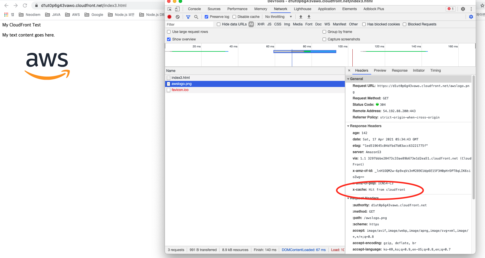

--------------------
# Aws-study
--------------------

# 목차

- [AWS FAQ](#AWS-FAQ)
- [서버리스 웹 호스팅과 CloudFront로 웹 가속화 구성하기](#서버리스-웹-호스팅과-CloudFront로-웹-가속화-구성하기)
    - [아키텍처에 구현할 기술](#아키텍처에-구현할-기술)

# AWS FAQ

- Amazon S3
  - FAQ : https://aws.amazon.com/ko/s3/faqs/?nc=sn&loc=7
- Amazon CloudFront
  - FAQ : https://aws.amazon.com/ko/cloudfront/faqs/?nc=sn&loc=5&dn=2
- Amazon EC2
  - FAQ : https://aws.amazon.com/ko/ec2/faqs/
- Elastic Load Balancer
  - FAQ : https://aws.amazon.com/ko/elasticloadbalancing/faqs/?nc=sn&loc=6
- Amazon VPC
  - FAQ : https://aws.amazon.com/ko/vpc/faqs/
- Amazon RDS
  - FAQ : https://aws.amazon.com/ko/rds/faqs/
- Auto Scaling
  - FAQ : https://aws.amazon.com/ko/autoscaling/faqs/
- IAM User
    - User 생성 가이드 : https://docs.aws.amazon.com/ko_kr/IAM/latest/UserGuide/id_users_create.html

# 서버리스 웹 호스팅과 CloudFront로 웹 가속화 구성하기

##  아키텍처에 구현할 기술

서버가 없이도 구성이 가능한 정적 웹 호스팅을 만들고, 웹 속도를 높이기 위하여 콘텐츠 전송 네트워크(CDN) 서비스를 연동합니다.

- 필요한 서비스
    - Amazon S3
    - Amazon CloudFront

## S3

Html, 영상, 기타 컨텐츠를 업로드하여 웹 호스팅 설정을 하게되면 웹 사이트처럼 작동할 수 있습니다.  
기본적으로 S3는 인터넷용 Storage 이며 웹 서비스 인터페이스를 사용해서 웹에서 언제든지 어디서나 원하는 양의  
데이터를 저장하고 검색할 수 있기 때문에 S3 만으로도 웹 호스팅이 가능하지만 웹 브라우저에서 읽어야 하는 컨텐츠  
크기가 커지면 그만큼 로딩이 지연되는 문제가 발생합니다.  
이러한 문제를 해결할 수 있는 것이 바로 `컨텐츠 전송 네트워크 서비스(CloudFront)` 입니다.

### S3 생성 후 살펴보기

1. 생성한 버킷
2. 메뉴 - 속성
    - 정적 웹 사이트 호스팅 - 편집 
    - 상태 - 활성화
    - 인덱스 문서 - 웹 사이트의 홈 페이지 또는 기본 페이지를 지정합니다.
        - index.html 작성하여 시작시 가장 처음 읽는 파일을 설정합니다.
3. 메뉴 - 권한
    - 버킷 정책 - 편집
    - 정책 생성기
        - Select Type of Policy - S3 Bucket Policy
    - 권한적인 부분(Add Statement) 설정
        - Principal - [ * ] 입력하여 모든 서비스를 적용한다고 명시합니다.
        - Actions - 어떠한 권한을 적용할것인지 설정합니다.
        - Amazon Resource Name (ARN) - 버킷 ARN 복사 붙여넣기하여 적용하기 (img_01)
        - Add Statement -> Generate Policy 클릭하여 생성된 정책을 복사합니다. (img_02)
    - 정책 편집기 - 정책 수정 (img_02)
        - 이렇게 되면 컨텐츠를 버킷에 올리더라도 웹 호스팅이 되지 않게 됩니다.
        - Resource - [ /* ] 문자를 추가하여 버킷 안에있는 모든 컨텐츠는 웹으로 나가는 것을 허용한다고 명시합니다. 
            - "Resource": "arn:aws:s3:::jjunpro-site/*",
    

- 4. html 업로드
    - html 파일 클릭 후 객체 URL 클릭 하면 서버없이 웹 호스팅이 가능합니다.

## CloudFront

컨텐츠를 빠르게 읽을 수 있도록 캐싱 기능을 제공하므로 더욱 가속화 된 웹을 제공할 수 있습니다.  

https://console.aws.amazon.com/cloudfront/home?region=ap-northeast-2#

1. Create Distribution -> Web Get Started
2. Distribution Settings - Price Class
    - 특정 지역에만 캐싱을 하겠다고 설정합니다.
        - Use Only U.S., Canada and Europe - 특정 지역
        - Use U.S., Canada, Europe, Asia, Middle East and Africa - 특정 지역
        - Use All Edge Locations (Best Performance) - 모든 지역
3. CloudFront에서 Create Distribution 클릭 후 Deploy가 되기까지는 약 5분~10분정도의 긴 시간이 소요
4. CloudFront 링크테스트
    - html 에서 불러오는 이미지의 경로를 CloudFront 도메인 으로 변경합니다.
    - 그리고 S3 버킷에 업로드 합니다.

~~~
<html>
<head>My CloudFront Test</head>
<body>

My text content goes here.

/awslogo.png" alt="AWS LOGO"/>

</body>
</html>
~~~ 

5. 브라우저 테스트
    - https://d1ut0p6g43vawo.cloudfront.net/index3.html
    - x-cache: Hit from cloudfront 
        정상적으로 cloudfront 로 캐싱된 상태임을 확인할 수 있습니다. 
    
 
